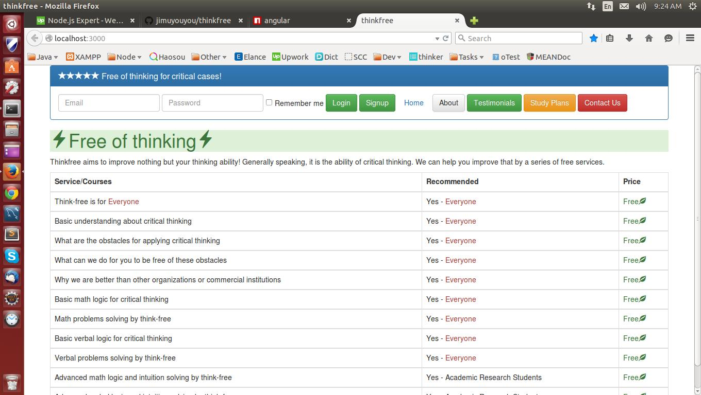

# screenshot

# thinkfree
NodeJS ExpressJS Express-Session EJS Mongoose Mongoodb AngularJS Bootstrap

This simple app aims to provide above techonologies integration. 
1. NodeJS is a trend now, so I use it as server here 
2. ExpressJS is the most fastest way to create a node web application, that's why I choose it 
3. Session is really very important for any real app, this is a must 
4. EJS, I choose EJS this actually because of AngularJS 
As most comments said, Jade is somewhat slow, especially not friendly to frontend developers. Then I was considering to use HandleBars, but it happens to use the same notation {{}} with AngularJS. Thus after serious consideration I choose EJS. 
5. MongooDB is great and friendly to NodeJS, no reason to use others 
6. Mongoose is an Object Schema for operating Mongoodb in Node, that's great 
7. AngularJS, it is famous for the data-binding, and that's the only feature used in this project.
I didn't use the redirection and validation, since it might be a risk for a project to use customer-side redirection. 
8. Bootstrap, this is a CSS framework aims to provide screen sensitive for computer, pad and mobile phones. Must have 

By the way, I am planning to use as less Restful services as possible in this project. It is because, restful apis is hard to manage the data security.

-------------------------------------------------------------------------------------------------------
Setup guide: 
1. git clone https://github.com/jimuyouyou/thinkfree.git 
2. cd thinkfree 
3. npm install 
4. mongod to start your mongodb 
5. node bin/www or npm start to run the server 
6. visit http://localhost:3000 the homepage 

## Usage

## Developing

### Tools

Created with [Nodeclipse](https://github.com/Nodeclipse/nodeclipse-1)
 ([Eclipse Marketplace](http://marketplace.eclipse.org/content/nodeclipse), [site](http://www.nodeclipse.org))   

Nodeclipse is free open-source project that grows with your contributions.

